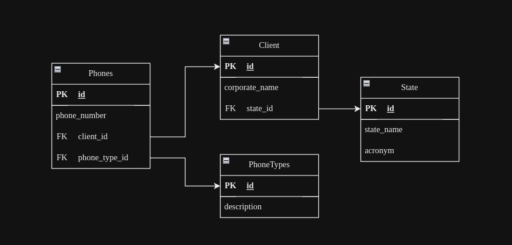

## Este é o teste solicitado pela Target Sitemas

Foi estruturado um banco de acordo com o solicitado no teste. Afim de tornar o teste mais interativo fiz uma imagem docker que inicia um container docker com uma imagem do postgres db. Assim que o container é iniciado, já são criada as tabelas e inseridos alguns dados de exemplo.

#### Para iniciar o banco de dados basta iniciar o comando  
```
docker-compose up --build -d
```
Após iniciado o container, o avaliador pode acessar o banco com a ferramenta que preferir (ex: DBeaver)

O comando SQL que foi solicitado no teste encontra-se no arquivo select.sql

## Abaixo está o esquema do DB solicitado:


 Nesse esquema todos os requisitos ,previamente solicitados, podem ser cumpridos:
- Um cliente pode ter um número ilimitado de telefones;
- Cada telefone de cliente tem um tipo. O sistema  permiti cadastrar novos tipos de telefone;
- O sistema permite cadastrar novos estados;

Quaisquers dúvidas estou a disposição.